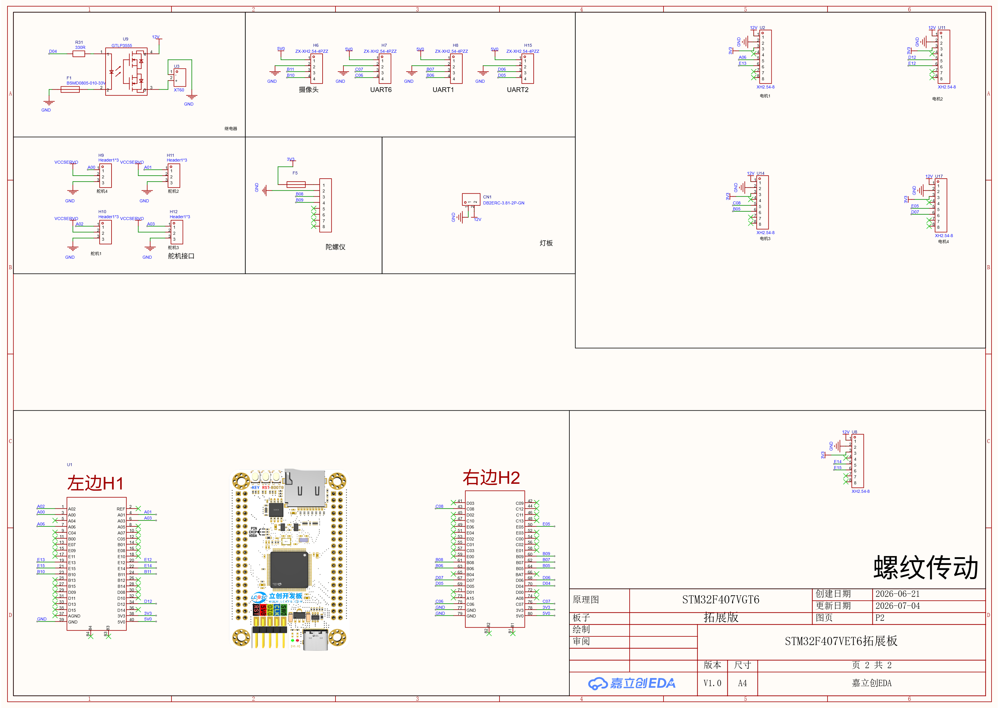
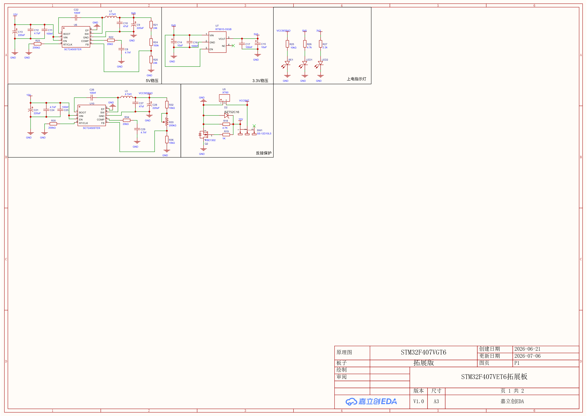
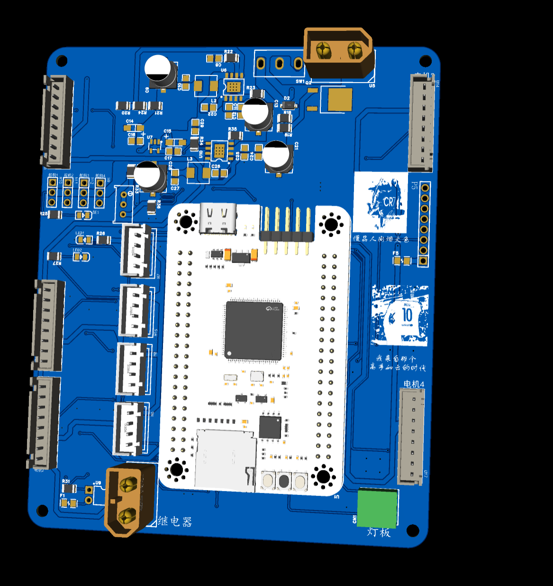

# 摄像头搬运机器人

## Camera Transport Robot

> 基于 STM32F407 + OpenART mini 视觉反馈的全向自主搬运系统

---

## 一、项目概述

本项目是一个**四轮麦克纳姆轮全向移动机器人**，通过 OpenART mini 摄像头获取视觉信息（十字地标校准位姿、物块颜色识别），由 STM32F407VGT6 作为主控运行 FreeRTOS 实时操作系统，驱动 42 闭环步进电机实现毫米级精确定位与自主搬运。

| 属性 | 说明 |
|------|------|
| 主控芯片 | STM32F407VGT6（ARM Cortex-M4，168MHz） |
| 操作系统 | FreeRTOS 10.x（CMSIS-OS v2 封装） |
| 开发工具 | Keil MDK-ARM 5 / STM32CubeMX / VSCode EIDE |
| 底盘 | 麦克纳姆轮全向底盘（4 × 42 闭环步进电机） |
| 夹具 | 2 × 25kg 270° 舵机 + 升降步进电机 |
| 摄像头 | OpenART mini（K230）→ USART2(十字校准) + USART3(颜色检测) |
| 陀螺仪 | MPU6050（I²C1 DMA 异步读取） |
| 定位精度 | ±2mm（里程计 + 视觉校准融合） |

---

## 二、硬件架构

### 2.1 系统框图

```
┌─────────────────────────────────────────────────────────────┐
│                     STM32F407VGT6                           │
│                                                             │
│  ┌──────────┐  ┌──────────┐  ┌──────────┐  ┌──────────┐   │
│  │ USART1   │  │ USART2   │  │ USART3   │  │ USART6   │   │
│  │ 调试日志  │  │ 十字校准  │  │ 颜色检测  │  │ (预留)    │   │
│  │ 115200   │  │ DMA      │  │ DMA      │  │ 115200   │   │
│  │ PB6/PB7  │  │ PD5/PD6  │  │ PB10/PB11│  │ PC6/PC7  │   │
│  └────┬─────┘  └────┬─────┘  └────┬─────┘  └──────────┘   │
│       │             │             │                         │
│  ┌────┴─────────────┴─────────────┴────────────────────┐   │
│  │              OpenART mini (K230)                     │   │
│  │  十字地标识别(ID 0)  │  颜色物块检测(ID 0)           │   │
│  └─────────────────────────────────────────────────────┘   │
│                                                             │
│  ┌──────────┐  ┌──────────────────────────────────────┐    │
│  │ I²C1     │  │ TIM1/3/4/5/8 → 5 路步进 PWM          │    │
│  │ MPU6050  │  │ 4 轮 + 1 升降                         │    │
│  │ DMA      │  │ GPIO → DIR(方向)                      │    │
│  │ PB8/PB9  │  └──────────────────────────────────────┘    │
│  └──────────┘                                               │
└─────────────────────────────────────────────────────────────┘
```

### 2.2 MCU 引脚分配

| 外设 | 引脚 | 功能 |
|------|------|------|
| USART1 TX/RX | PB6 / PB7 | 串口调试日志（115200-8N1） |
| USART2 TX/RX | PD5 / PD6 | OpenART 十字校准（DMA） |
| USART3 TX/RX | PB10 / PB11 | OpenART 颜色检测（DMA） |
| USART6 TX/RX | PC6 / PC7 | 预留扩展 |
| I²C1 SDA/SCL | PB9 / PB8 | MPU6050 陀螺仪（DMA） |
| TIM1 CH1-4 | — | 步进电机 PWM（4 轮） |
| TIM3 CH1 | — | 升降步进 PWM |
| GPIO | 多路 | 步进电机 DIR 方向控制 / 舵机信号 |

### 2.3 拓展板设计

#### 原理图





#### PCB 布局



---

## 三、软件架构

### 3.1 FreeRTOS 任务设计

| 任务 | 句柄 | 优先级 | 堆栈 | 节拍 | 职责 |
|------|------|--------|------|------|------|
| `chassisTask` | `osPriorityAboveNormal` | 2048B | **1ms** | 底盘控制环：梯形加减速 → 麦轮逆解 → 步进速度下发 |
| `gyroTask` | `osPriorityHigh` | 2048B | **1ms** | DMA 异步读 MPU6050 → yaw 积分 → 注入 chassis |
| `clampTask` | `osPriorityAboveNormal` | 2048B | **1ms** | 夹具控制环：升降步进梯形加减速 |
| `defaultTask` | `osPriorityNormal` | 512B | **10ms** | 指令编排：状态机、串口日志、摄像头校准/颜色检测调用 |

> **设计要点**：`gyroTask` 和 `chassisTask` 虽优先级不同，但均通过 DMA + 信号量异步等待，真正挂起期间不占 CPU，二者互不干扰。`chassisTask` 的 1ms 控制环精度不受影响。

### 3.2 模块文件清单

| 分类 | 文件 | 说明 |
|------|------|------|
| **底盘运动** | `mecanum.c` | 麦克纳姆轮运动学（正解 / 逆解） |
| | `trape.c` | 梯形速度曲线规划器 |
| | `chassis.c` | 底盘控制层：目标追踪、里程计积分 |
| **视觉系统** | `camera_align.c` | 十字地标校准（USART2 + DMA） |
| | `camera_color.c` | 颜色物块检测（USART3 + DMA） |
| | `cross_detect.c` | 十字检测辅助 |
| **驱动层** | `stepper.c` | 步进电机 PWM 驱动（5 路） |
| | `servo.c` | 舵机控制 |
| | `mpu6050.c` | 陀螺仪驱动与姿态解算 |
| **夹具** | `clamp.c` | 夹具控制层：升降 + 旋转 + 夹爪 |
| **系统** | `main.c` | 硬件初始化 |
| | `freertos.c` | RTOS 任务创建与启动 |
| | `usart.c` | 串口初始化 + HAL 回调（收/发/错误） |
| | `gpio.c` / `i2c.c` / `dma.c` / `tim.c` | 外设 HAL 层配置 |
| | `usb_otg.c` | USB OTG（预留） |
| | `stm32f4xx_it.c` | 中断向量表 |
| | `stm32f4xx_hal_msp.c` | HAL 底层 MSP 配置 |

---

## 四、底盘运动控制

### 4.1 麦克纳姆轮运动学

文件 `Core/Src/mecanum.c`

- **逆解** `mecanum_inverse(vx, vy, omega) → wheel_speed[4]`：将车体目标速度分解为四轮线速度
- **正解** `mecanum_forward(wheel_speed[4]) → (vx, vy, omega)`：由四轮速度反推车体运动
- 几何参数通过宏配置（轮距、轴距、轮半径）

### 4.2 梯形速度曲线

文件 `Core/Src/trape.c`

- 梯形曲线：加速 → 匀速 → 减速三阶段
- 到位判断：位置偏差 < 阈值 + 速度归零

### 4.3 底盘控制层

文件 `Core/Src/chassis.c`

- `chassis_tick()`：1ms 控制环核心，内部执行：
  1. 读目标位姿 → 计算位置误差
  2. 梯形曲线规划 → 输出目标速度 (vx, vy, omega)
  3. 麦轮逆解 → 四轮线速度
  4. 里程计积分 → 更新当前位姿
- `chassis_set_pose(x, y, theta)`：原子写入位姿（十字校准后调用）
- `chassis_feed_gyro(yaw)`：陀螺仪 yaw 注入（替代里程计 theta）
- `move_to_coordinate(x, y)`：发起-查询语义，反复调用直到返回 `true`

---

## 五、摄像头视觉系统

OpenART mini 通过两路 USART 与 STM32 通信，均采用**请求-应答异步模式**（DMA 收发 + FreeRTOS 信号量同步），不占用 CPU，不影响 1ms 控制环。

### 5.1 十字地标校准 `camera_align`

**通信接口**：USART2（PD5-TX / PD6-RX），115200-8N1，DMA（TX: Stream6 / RX: Stream5）

**请求帧**（3 字节）：

| 偏移 | 值 | 说明 |
|------|-----|------|
| 0 | `0xAA` | 帧头 SOF0 |
| 1 | `0x55` | 帧头 SOF1 |
| 2 | `ID` | 十字编号（0~N） |

**应答帧**（8 字节）：

| 偏移 | 值 | 说明 |
|------|-----|------|
| 0 | `0xAA` | 帧头 SOF0 |
| 1 | `0x55` | 帧头 SOF1 |
| 2 | `STATUS` | 0=检测到，非0=未检测到 |
| 3-4 | `DX` | int16 小端，十字相对图像中心 X 像素偏移 |
| 5-6 | `DY` | int16 小端，十字相对图像中心 Y 像素偏移 |
| 7 | `XOR` | 前 7 字节异或校验 |

**API**：

```c
void camera_align_init(void);  // 初始化信号量（MX_FREERTOS_Init 中调用）

bool camera_align_at(uint8_t id, float cross_wx, float cross_wy, uint32_t timeout_ms);
// 发起十字校准请求。cross_wx/cross_wy 为已知十字世界坐标(mm)
// 检测成功 → 像素偏移换算为世界系偏移 → 反推车位姿 → chassis_set_pose 注入
// 返回 true 表示校准成功
```

**几何模型**：像素偏移 + 安装偏移 → 车体系偏移 → 世界旋转 → 十字世界坐标 − 偏移 = 车位姿

---

### 5.2 颜色物块检测 `camera_color`

**通信接口**：USART3（PB10-TX / PB11-RX），115200-8N1，DMA（TX: Stream3 / RX: Stream1）

**请求帧**（3 字节）：

| 偏移 | 值 | 说明 |
|------|-----|------|
| 0 | `0xAA` | 帧头 SOF0 |
| 1 | `0x55` | 帧头 SOF1 |
| 2 | `0x00` | 颜色检测 ID（固定 0x00） |

**应答帧**（8 字节）：

| 偏移 | 值 | 说明 |
|------|-----|------|
| 0 | `0xAA` | 帧头 SOF0 |
| 1 | `0x55` | 帧头 SOF1 |
| 2 | `COLOR` | 颜色编号（见下表） |
| 3-4 | `MX` | uint16 小端，色块中心 X 像素坐标 |
| 5-6 | `MY` | uint16 小端，色块中心 Y 像素坐标 |
| 7 | `XOR` | 前 7 字节异或校验 |

**颜色编号**：

| 常量 | 值 | 含义 |
|------|-----|------|
| `CAM_COLOR_NONE` | 0 | 未检测到色块 |
| `CAM_COLOR_RED` | 1 | 红色 |
| `CAM_COLOR_YELLOW` | 2 | 黄色 |
| `CAM_COLOR_BLUE` | 3 | 蓝色 |
| `CAM_COLOR_WHITE` | 4 | 白色 |
| `CAM_COLOR_BLACK` | 5 | 黑色 |

**API**：

```c
void camera_color_init(void);  // 初始化信号量（MX_FREERTOS_Init 中调用）

bool camera_color_detect(uint8_t *out_color, uint16_t *out_mx, uint16_t *out_my, uint32_t timeout_ms);
// 发起一次颜色检测请求（阻塞式，内部异步等待 DMA 完成）
//   out_color : 输出颜色编号（0~5），为 NULL 则不关心
//   out_mx/my : 输出色块中心像素坐标，为 NULL 则不关心
//   timeout_ms: 等待应答超时(ms)，0=使用默认 500ms
//   返回 true: 检测到有效色块；false: 超时/校验失败/未检测到

void camera_color_get_last_raw(uint8_t *color, uint16_t *mx, uint16_t *my);
// 取最近一次成功检测的原始数据（调试用）
```

**调用示例**：

```c
// 基础调用
uint8_t color;
uint16_t mx, my;
if (camera_color_detect(&color, &mx, &my, 500)) {
    printf("[color] detected: color=%d, center=(%d,%d)px\r\n", color, mx, my);
}

// 仅关心颜色，不关心坐标
uint8_t c;
if (camera_color_detect(&c, NULL, NULL, 300)) {
    if (c == CAM_COLOR_RED) {
        // 红色物块处理逻辑
    }
}

// 集成到状态机
case STATE_DETECT_COLOR:
{
    uint8_t color;
    if (camera_color_detect(&color, NULL, NULL, 500)) {
        state = (color == CAM_COLOR_RED) ? STATE_PICK_RED : STATE_PICK_OTHER;
    }
    break;
}
```

**数据流**：

```
调用 camera_color_detect()
  ├─ 清空残留信号量
  ├─ 组帧 [AA 55 00]
  ├─ HAL_UART_Receive_DMA 启动接收（先于发送以避免竞态）
  ├─ HAL_UART_Transmit_DMA 发送请求
  ├─ xSemaphoreTake 等 TX 完成（100ms 超时）
  ├─ xSemaphoreTake 等 RX 完成（timeout_ms 超时）
  ├─ 校验帧头 + XOR
  └─ 解析 COLOR + MX + MY → 输出
```

> **注意**：`camera_color` 和 `camera_align` 共享 `usart.c` 中的 HAL 回调（TxCplt / RxCplt / ErrorCallback），通过 `huart->Instance` 区分 USART2/USART3。信号量和忙标志通过 `extern` 跨文件暴露。
>
> **不可重入**：两个模块的缓冲区和信号量均为静态全局变量，同一时刻各自只能有一个请求在进行。

---

## 六、步进电机控制

文件 `Core/Src/stepper.c`

- 5 路独立 PWM：TIM1 CH1-4（四轮）、TIM3 CH1（升降）
- 速度换算：`mm/s → 脉冲频率 → TIM ARR/PRESCALER`
- DIR 引脚通过 GPIO 控制方向
- `Stepper_SetWheelSpeedAll(w[4])`：由 chassisTask 每 1ms 下发四轮目标线速度

---

## 七、陀螺仪姿态

文件 `Core/Src/mpu6050.c`

- **接口**：I²C1（PB8-SCL / PB9-SDA），DMA 异步读取 14 字节（加速度 + 陀螺仪 + 温度）
- **初始化**：`gyroTask` 启动时调用 `MPU6050_Init()`（需要 HAL_Delay，必须在调度器启动后）
- **零漂校准**：上电静止时采集 256 样本，3σ 鲁棒均值滤波
- **姿态解算**：`MPU6050_IntegrateYaw(dt)` 对 z 轴角速度积分得到 yaw
- **温度补偿**：运行时跟踪温度变化，必要时自动重校准
- **数据注入**：`chassis_feed_gyro(yaw)` 将陀螺仪 yaw 原子写入 chassis 位姿

**数据流**：

```
gyroTask (1ms 循环):
  ├─ MPU6050_StartReadDMA()           // 启动 DMA 读（非阻塞）
  ├─ xSemaphoreTake(5ms超时)          // 等待 DMA 完成（挂起）
  ├─ MPU6050_OnDMAComplete()          // 解析数据
  ├─ MPU6050_IntegrateYaw(dt)         // 积分 yaw
  └─ chassis_feed_gyro(yaw)           // 注入底盘
```

---

## 八、夹具控制

文件 `Core/Src/clamp.c`

- **升降轴**：步进电机，梯形速度曲线（`clamp_tick()` 1ms 控制环）
- **旋转**：270° 舵机（`clamp_rotate_set(angle)`）
- **夹爪**：开/合（`clamp_gripper_open()` / `clamp_gripper_close()`）
- **高层指令**：`clamp_set_height(target_mm)` 发起-查询语义

---

## 九、构建与烧录

### 9.1 开发环境

| 工具 | 版本/说明 |
|------|-----------|
| IDE | Keil MDK-ARM 5.x |
| 编译器 | ARM Compiler 6（AC6） |
| 代码生成 | STM32CubeMX 6.x |
| 烧录工具 | ST-LINK / J-LINK / DAP-LINK |

### 9.2 工程文件

```
MDK-ARM/
├── Robot.uvprojx            # Keil 工程
├── Robot.uvoptx             # 工程配置
├── DebugConfig/             # 调试配置
└── Robot/
    ├── Robot.axf            # 编译产物（ELF）
    ├── Robot.hex            # 固件烧录文件
    └── Robot.map            # 内存映射表
```

### 9.3 编译步骤

1. 用 Keil MDK 打开 `MDK-ARM/Robot.uvprojx`
2. 选择 Target → Rebuild all（或按 F7）
3. 产物位于 `MDK-ARM/Robot/Robot.hex`

### 9.4 烧录

使用 ST-LINK Utility 或 Keil 内建 Flash Download 功能，将 `Robot.hex` 写入 STM32F407VGT6。

---

## 十、单元测试

项目包含 PC 端单元测试（无需硬件），对纯算法模块进行验证。

详见 `test/README.md`。

**快速运行**：

```bash
mingw32-make -C test clean
mingw32-make -C test
test/bin/run_tests.exe
```

**测试范围**：麦克纳姆轮运动学、梯形速度曲线规划器、底盘控制层逻辑。

---

## 十一、变更记录

| 日期 | 变更内容 |
|------|----------|
| 2026-07-31 | 🔧 **修复 `camera_color_init()` 未调用问题**：在 `freertos.c` 中添加 `#include "camera_color.h"` 和 `camera_color_init()` 初始化调用，解决颜色检测模块因信号量未创建而始终返回 `false` 的严重 Bug |
| 2026-07-31 | 📝 **重写 README.md**：从简单 BOM 清单升级为完整技术文档，涵盖硬件架构、软件模块、协议定义、API 参考和调用示例 |
| 2026-07-31 | 📝 **修正文档**：移除所有"S 形曲线"描述（`trape.c` 仅实现梯形加减速），插入拓展板原理图与 PCB 布局图 |

---

## 附录 A：拓展板 BOM 物料清单

| No. | 数量 | Comment | Designator | Footprint | Manufacturer Part | Manufacturer | Supplier Part | Supplier |
| --- | ---- | ------- | ---------- | --------- | ----------------- | ------------ | ------------- | -------- |
| 1 | 2 | 4.7nf | C8,C29 | C0805 | CL21A475KAQNNNE | SAMSUNG(三星) | C1779 | LCSC |
| 2 | 4 | 220uF | C9,C13,C21,C28 | CAP-SMD_BD6.3-L6.6-W6.6-LS7.6-FD-1 | RVE100UF35V67RV0072 | KNSCHA(科尼盛) | C2836437 | LCSC |
| 3 | 2 | 47uf | C10,C27 | C0805 | CL21A475KAQNNNE | SAMSUNG(三星) | C1779 | LCSC |
| 4 | 4 | 100nf | C11,C22,C25,C26 | C0805 | CL21A475KAQNNNE | SAMSUNG(三星) | C1779 | LCSC |
| 5 | 2 | 4.7uF | C12,C24 | C0805 | CL21A475KAQNNNE | SAMSUNG(三星) | C1779 | LCSC |
| 6 | 2 | 10uF | C14,C15 | CAP-SMD_L3.2-W1.6-RD-C7171 | TAJA106K016RNJ | Kyocera AVX | C7171 | LCSC |
| 7 | 2 | 100nF | C16,C17 | C0805 | CL21A475KAQNNNE | SAMSUNG(三星) | C1779 | LCSC |
| 8 | 1 | DB2ERC-3.81-2P-GN | CN1 | CONN-TH_2P-P3.81_DB2ERC-3.81-2P | DB2ERC-3.81-2P-GN | DORABO(地博电气) | C395684 | LCSC |
| 9 | 1 | D2 | D2 | SOD-123_L2.7-W1.7-LS3.8-RD | BZT52C16 | TWGMC(台湾迪嘉) | C727007 | LCSC |
| 10 | 2 | BSMD0805-010-33V | F1,F5 | F0805 | BSMD0805-010-33V | BHFUSE(佰宏) | C883101 | LCSC |
| 11 | 4 | ZX-XH2.54-4PZZ | H6,H7,H8,H15 | CONN-TH_4P-P2.50_4PIN | ZX-XH2.54-4PZZ | Megastar(兆星) | C7429634 | LCSC |
| 12 | 4 | Header1*3 | H9,H10,H11,H12 | HDR-TH_3P-P2.54-V-M | PZ254V-11-03P | XFCN(兴飞) | C2937625 | LCSC |
| 13 | 2 | 4.7uH | L2,L3 | IND-SMD_L5.4-W5.2 | SLO0530H4R7MTT | Sunltech(韩国顺磁) | C325964 | LCSC |
| 14 | 3 | FC-2012HRK-620D | LED1,LED2,SE1 | LED0805-R-RD | NCD0805R1 | 国星光电 | C84256 | LCSC |
| 15 | 1 | Header-Female-2.54_1x8 | P5 | HDR-TH_8P-P2.54-V-F-1 | 2.54-1*8P母环保 | BOOMELE(博穆精密) | C27438 | LCSC |
| 16 | 1 | VBE1302 | Q2 | TO-252-2_L6.6-W6.1-P4.58-LS9.9-TL-1 | VBE1302 | VBsemi(微碧半导体) | C480950 | LCSC |
| 17 | 1 | 4.7K | R18 | R0805 | 0805W8F2003T5E | UNI-ROYAL(厚声) | C17539 | LCSC |
| 18 | 1 | 1K | R19 | R0805 | 0805W8F2003T5E | UNI-ROYAL(厚声) | C17539 | LCSC |
| 19 | 2 | 24k | R20,R21 | R0805 | 0805W8F2003T5E | UNI-ROYAL(厚声) | C17539 | LCSC |
| 20 | 2 | 20kΩ | R22,R34 | R0805 | 0805W8F2003T5E | UNI-ROYAL(厚声) | C17539 | LCSC |
| 21 | 2 | 200kΩ | R23,R35 | R0805 | 0805W8F2003T5E | UNI-ROYAL(厚声) | C17539 | LCSC |
| 22 | 1 | 100k | R24 | R0805 | 0805W8F2003T5E | UNI-ROYAL(厚声) | C17539 | LCSC |
| 23 | 3 | 10kΩ | R25,R32,R36 | R0805 | 0805W8F2003T5E | UNI-ROYAL(厚声) | C17539 | LCSC |
| 24 | 1 | 4.7k | R26 | R0805 | 0805W8F2003T5E | UNI-ROYAL(厚声) | C17539 | LCSC |
| 25 | 1 | 2.2k | R27 | R0805 | 0805W8F2003T5E | UNI-ROYAL(厚声) | C17539 | LCSC |
| 26 | 1 | 330R | R31 | R0805 | — | — | — | — |
| 27 | 1 | 200kΩ | R33 | RES-ADJ-TH_3P-L10.0-W10.0-P2.50-L | 3296W-1-103 | BOCHEN(博晨) | C118954 | LCSC |
| 28 | 1 | SS-12D10L5 | SW1 | SW-TH_SS-12D10L5 | SS-12D10L5 | XKB Connectivity(中国星坤) | C319012 | LCSC |
| 29 | 1 | LCKFB-LSPI-SkyStar-STM32F407VGT6-PRO | U1 | COMM-TH_LCKFB-LSPI-SKYSTAR-STM32F407VGT6-PRO | LCKFB-LSPI-SkyStar-STM32F407VGT6-PRO | 立创开发板 | C32710423 | LCSC |
| 30 | 5 | XH2.54-8 | U2,U8,U11,U14,U17 | CONN-TH_8P-P2.54_XH2.54_C9900012080 | XH2.54-8 | — | C9900012080 | LCSC |
| 31 | 2 | XT60 | U3,U5 | CONN-TH_XT60 | XT60 | AMASS(艾迈斯) | C98733 | LCSC |
| 32 | 2 | SCT2450STER | U6,U10 | ESOP-8_L4.9-W3.9-P1.27-LS6.0-BL-EP | SCT2450STER | SCT(芯洲科技) | C509400 | LCSC |
| 33 | 1 | RT9013-33GB | U7 | SOT-23-5_L3.0-W1.7-P0.95-LS2.8-BL | RT9013-33GB | RICHTEK(立锜) | C47773 | LCSC |
| 34 | 1 | GTLP3555 | U9 | DIP-4_L6.5-W4.6-P2.54-LS7.6-BL | GTLP3555 | SUPSiC(国晶微半导体) | C19271984 | LCSC |